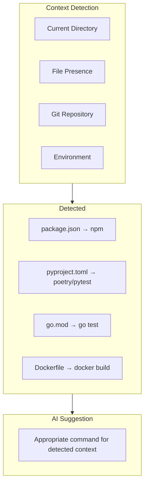

# diagram_06_untitled

```mermaid
flowchart TD
    subgraph Context["Context Detection"]
        Dir[Current Directory]
        Files[File Presence]
        Git[Git Repository]
        Env[Environment]
    end
    
    subgraph Detection["Detected"]
        Pkg[package.json → npm]
        Pyproject[pyproject.toml → poetry/pytest]
        GoMod[go.mod → go test]
        Docker[Dockerfile → docker build]
    end
    
    subgraph Suggestion["AI Suggestion"]
        Command[Appropriate command for detected context]
    end
    
    Context --> Detection --> Suggestion
```
