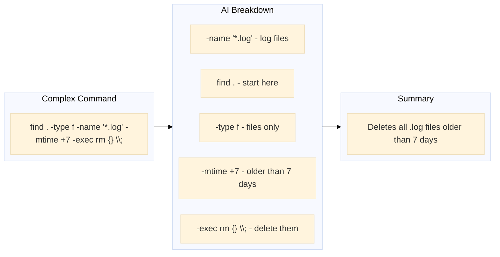

# diagram_07_untitled

```mermaid
---
config:
  theme: base
  layout: elk
---
flowchart LR
    subgraph Command["Complex Command"]
        Cmd["find . -type f -name '*.log' -mtime +7 -exec rm {} \\;"]
    end
    
    subgraph Breakdown["AI Breakdown"]
        Find["find . - start here"]
        Type["-type f - files only"]
        Name["-name '*.log' - log files"]
        Time["-mtime +7 - older than 7 days"]
        Exec["-exec rm {} \\; - delete them"]
    end
    
    subgraph Summary["Summary"]
        Result["Deletes all .log files older than 7 days"]
    end
    
    Command --> Breakdown
    Breakdown --> Summary
```
