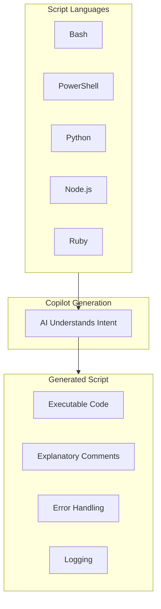

# diagram_08_multi-language-support

```mermaid
graph TD
    subgraph Languages["Script Languages"]
        Bash[Bash]
        PowerShell[PowerShell]
        Python[Python]
        Node[Node.js]
        Ruby[Ruby]
    end
    
    subgraph Generation["Copilot Generation"]
        AI[AI Understands Intent]
    end
    
    subgraph Output["Generated Script"]
        Code[Executable Code]
        Comments[Explanatory Comments]
        ErrorHandling[Error Handling]
        Logging[Logging]
    end
    
    Languages --> AI --> Output
```
