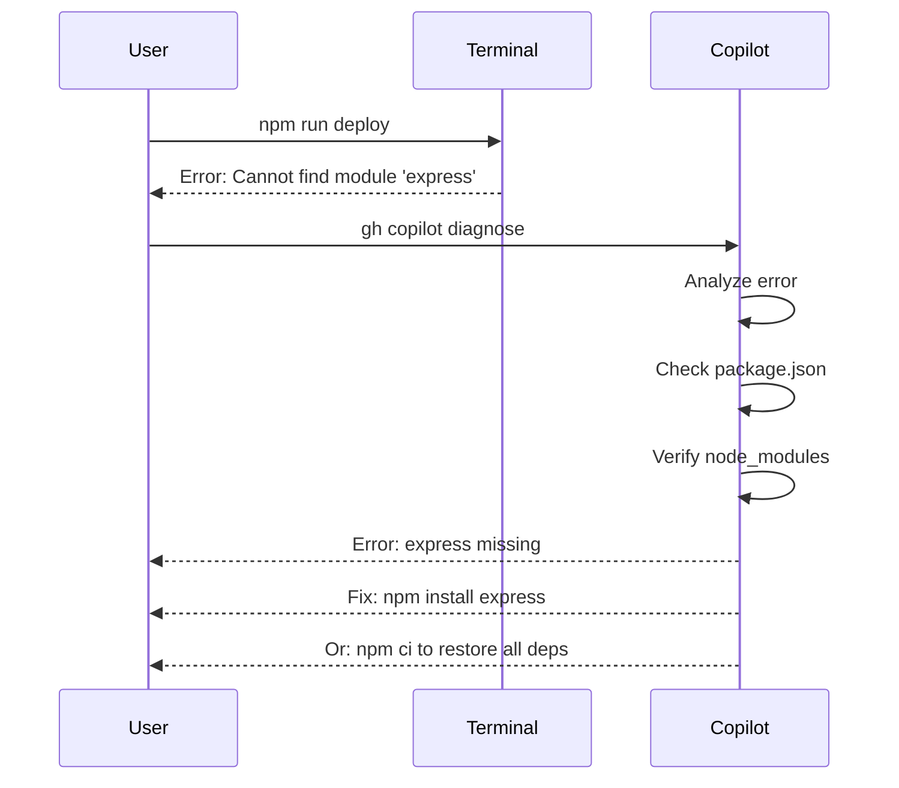

# diagram_09_when-a-command-fails-copilot-cli-can-diagnose-and-6109

```mermaid
sequenceDiagram
    participant User
    participant Terminal
    participant Copilot
    
    User->>Terminal: npm run deploy
    Terminal-->>User: Error: Cannot find module 'express'
    User->>Copilot: gh copilot diagnose
    
    Copilot->>Copilot: Analyze error
    Copilot->>Copilot: Check package.json
    Copilot->>Copilot: Verify node_modules
    
    Copilot-->>User: Error: express missing
    Copilot-->>User: Fix: npm install express
    Copilot-->>User: Or: npm ci to restore all deps
```
