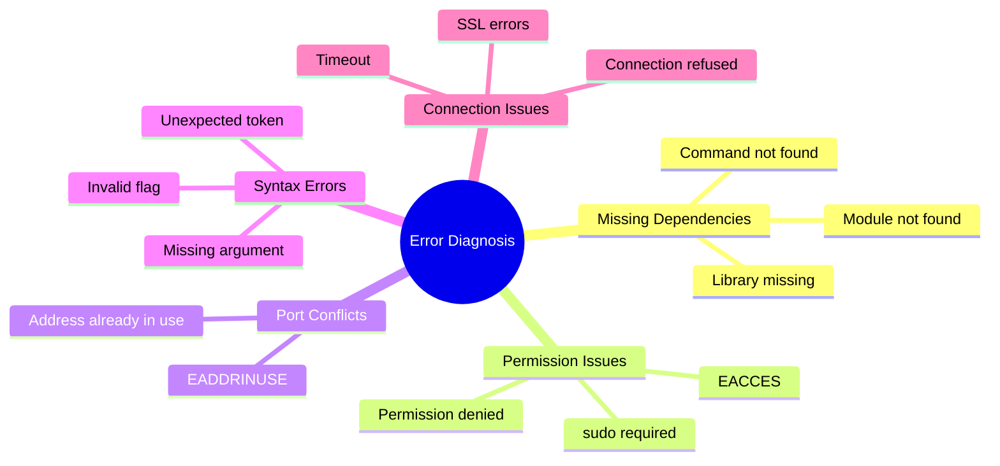

# diagram_10_common-error-patterns

```mermaid
mindmap
  root((Error Diagnosis))
    Missing Dependencies
      Module not found
      Command not found
      Library missing
    Permission Issues
      EACCES
      Permission denied
      sudo required
    Port Conflicts
      Address already in use
      EADDRINUSE
    Syntax Errors
      Unexpected token
      Invalid flag
      Missing argument
    Connection Issues
      Connection refused
      Timeout
      SSL errors
```
