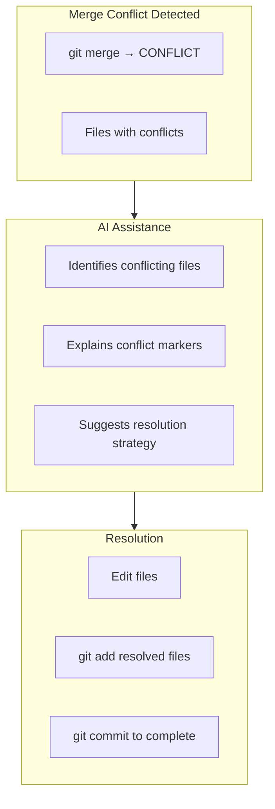

# diagram_11_untitled

```mermaid
flowchart TD
    subgraph Conflict["Merge Conflict Detected"]
        Git[git merge → CONFLICT]
        Files[Files with conflicts]
    end
    
    subgraph Copilot["AI Assistance"]
        Identify[Identifies conflicting files]
        Explain[Explains conflict markers]
        Suggest[Suggests resolution strategy]
    end
    
    subgraph Resolve["Resolution"]
        Edit[Edit files]
        Add[git add resolved files]
        Commit[git commit to complete]
    end
    
    Conflict --> Copilot --> Resolve
```
