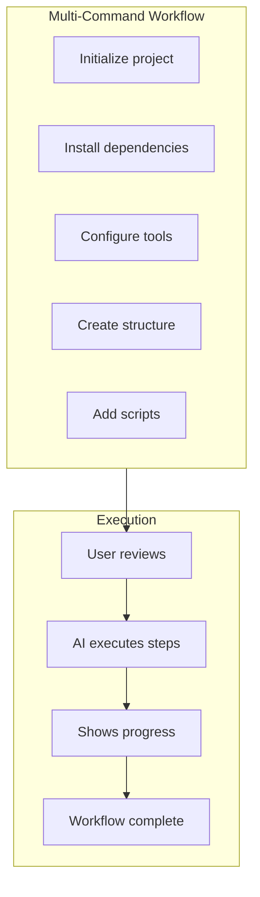

# diagram_12_untitled

```mermaid
flowchart TD
    subgraph Workflow["Multi-Command Workflow"]
        Step1[Initialize project]
        Step2[Install dependencies]
        Step3[Configure tools]
        Step4[Create structure]
        Step5[Add scripts]
    end
    
    subgraph Execution["Execution"]
        User[User reviews]
        Execute[AI executes steps]
        Progress[Shows progress]
        Complete[Workflow complete]
    end
    
    Workflow --> User --> Execute --> Progress --> Complete
```
