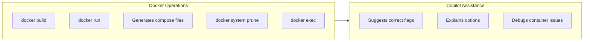

# diagram_13_untitled

```mermaid
flowchart LR
    subgraph Docker["Docker Operations"]
        Build[docker build]
        Run[docker run]
        Compose[docker-compose]
        Clean[docker system prune]
        Exec[docker exec]
    end
    
    subgraph Copilot["Copilot Assistance"]
        Suggest[Suggests correct flags]
        Explain[Explains options]
        Compose[Generates compose files]
        Debug[Debugs container issues]
    end
    
    Docker --> Copilot
```
