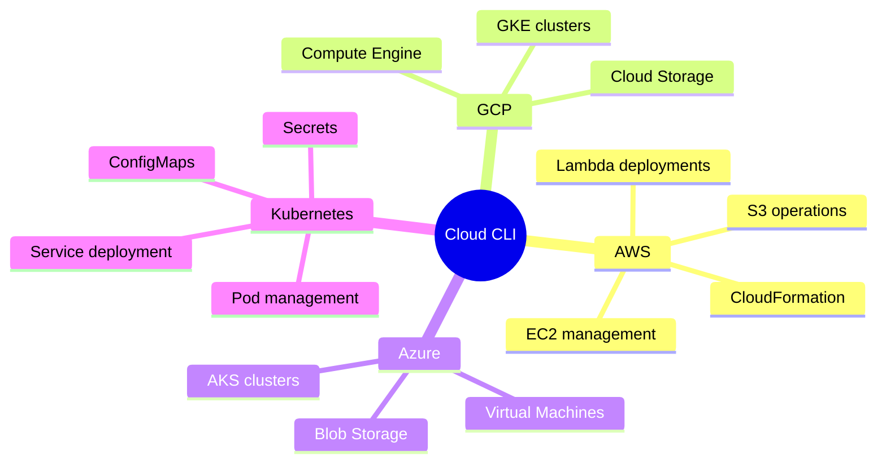

# diagram_14_untitled

```mermaid
mindmap
  root((Cloud CLI))
    AWS
      EC2 management
      S3 operations
      Lambda deployments
      CloudFormation
    GCP
      Compute Engine
      Cloud Storage
      GKE clusters
    Azure
      Virtual Machines
      Blob Storage
      AKS clusters
    Kubernetes
      Pod management
      Service deployment
      ConfigMaps
      Secrets
```
