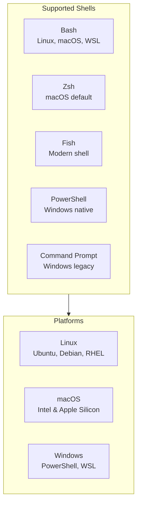

# diagram_15_shell-support

```mermaid
graph TD
    subgraph Shells["Supported Shells"]
        Bash[Bash<br/>Linux, macOS, WSL]
        Zsh[Zsh<br/>macOS default]
        Fish[Fish<br/>Modern shell]
        PowerShell[PowerShell<br/>Windows native]
        Cmd[Command Prompt<br/>Windows legacy]
    end
    
    subgraph Platforms["Platforms"]
        Linux[Linux<br/>Ubuntu, Debian, RHEL]
        macOS[macOS<br/>Intel & Apple Silicon]
        Windows[Windows<br/>PowerShell, WSL]
    end
    
    Shells --> Platforms
```
