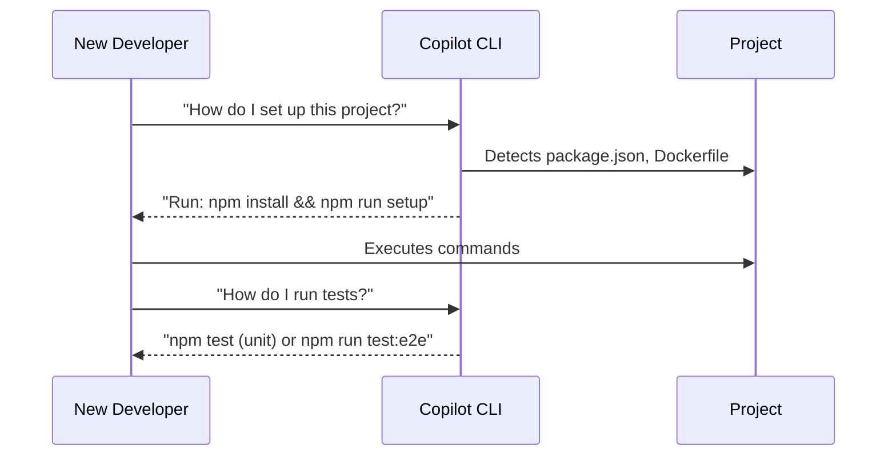

# diagram_16_use-case-1-onboarding-new-developers-7eb8

```mermaid
sequenceDiagram
    participant NewDev as New Developer
    participant Copilot as Copilot CLI
    participant Project as Project
    
    NewDev->>Copilot: "How do I set up this project?"
    Copilot->>Project: Detects package.json, Dockerfile
    Copilot-->>NewDev: "Run: npm install && npm run setup"
    NewDev->>Project: Executes commands
    NewDev->>Copilot: "How do I run tests?"
    Copilot-->>NewDev: "npm test (unit) or npm run test:e2e"
```
