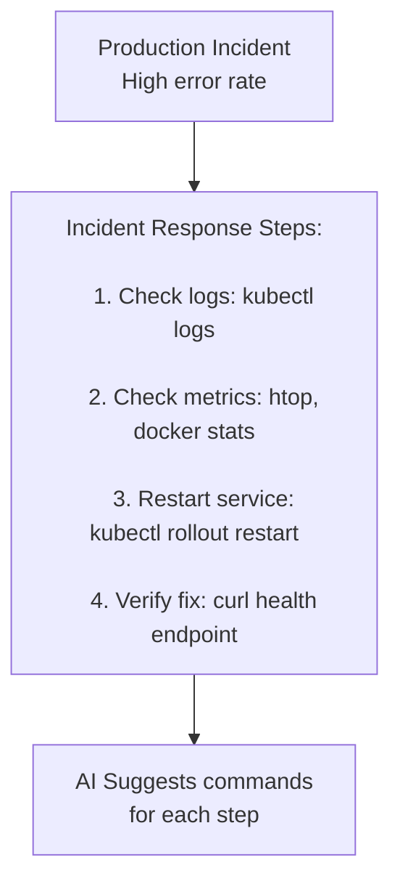

# diagram_17_use-case-2-production-incident-response-2f42

```mermaid
flowchart TD
    Incident[Production Incident<br/>High error rate]
    
    Steps[Incident Response Steps:<br/>
    1. Check logs: kubectl logs<br/>
    2. Check metrics: htop, docker stats<br/>
    3. Restart service: kubectl rollout restart<br/>
    4. Verify fix: curl health endpoint]
    
    Copilot[AI Suggests commands<br/>for each step]
    
    Incident --> Steps --> Copilot
```
