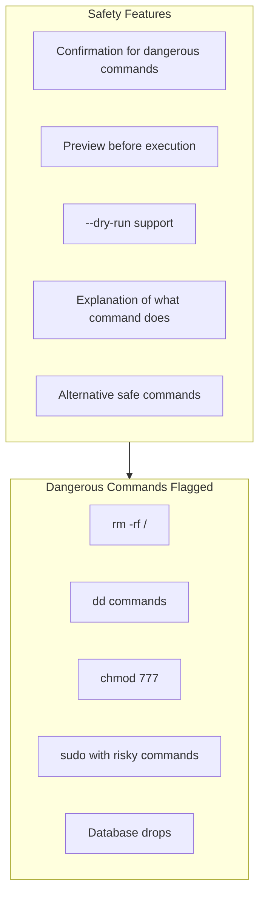

# diagram_23_safety-features

```mermaid
graph TD
    subgraph Safety["Safety Features"]
        Confirm[Confirmation for dangerous commands]
        Preview[Preview before execution]
        DryRun[--dry-run support]
        Explain[Explanation of what command does]
        Alternative[Alternative safe commands]
    end
    
    subgraph Dangerous["Dangerous Commands Flagged"]
        RM[rm -rf /]
        DD[dd commands]
        Chmod[chmod 777]
        Sudo[sudo with risky commands]
        Drop[Database drops]
    end
    
    Safety --> Dangerous
```
