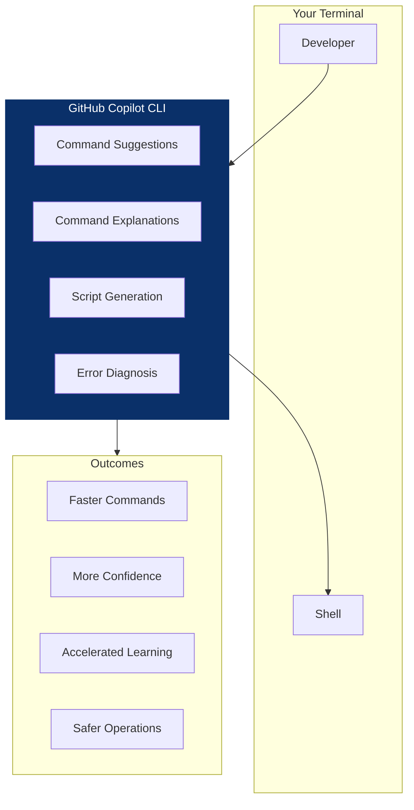

# diagram_24_copilot-cli-meets-you-where-you-livein-the-termin-c85e

```mermaid
graph TD
    subgraph Terminal["Your Terminal"]
        User[Developer]
        Shell[Shell]
    end
    
    subgraph Copilot["GitHub Copilot CLI"]
        Suggest[Command Suggestions]
        Explain[Command Explanations]
        Script[Script Generation]
        Diagnose[Error Diagnosis]
    end
    
    subgraph Outcomes["Outcomes"]
        Fast[Faster Commands]
        Confident[More Confidence]
        Learn[Accelerated Learning]
        Safe[Safer Operations]
    end
    
    User --> Copilot
    Copilot --> Shell
    Copilot --> Outcomes
    
    style Copilot fill:#0a3069,stroke:#0a3069,stroke-width:2px,color:#fff
```
