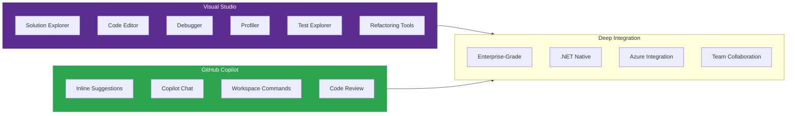

# diagram_02_github-copilot-in-visual-studio-isnt-just-a-port-4038

```mermaid
flowchart LR
    subgraph VS["Visual Studio"]
        SolutionExplorer[Solution Explorer]
        Editor[Code Editor]
        Debugger[Debugger]
        Profiler[Profiler]
        TestExplorer[Test Explorer]
        Refactoring[Refactoring Tools]
    end
    
    subgraph Copilot["GitHub Copilot"]
        Inline[Inline Suggestions]
        Chat[Copilot Chat]
        Commands[Workspace Commands]
        Review[Code Review]
    end
    
    subgraph Integration["Deep Integration"]
        Enterprise[Enterprise-Grade]
        .NET[.NET Native]
        Azure[Azure Integration]
        Team[Team Collaboration]
    end
    
    VS --> Integration
    Copilot --> Integration
    
    style VS fill:#5c2d91,stroke:#5c2d91,stroke-width:2px,color:#fff
    style Copilot fill:#2da44e,stroke:#2da44e,stroke-width:2px,color:#fff
```
