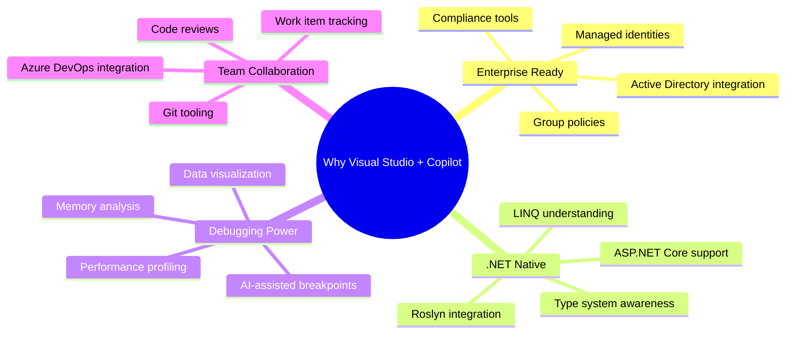

# diagram_03_visual-studios-enterprise-focused-architecture-ma-4e11

```mermaid
mindmap
  root((Why Visual Studio + Copilot))
    Enterprise Ready
      Active Directory integration
      Group policies
      Managed identities
      Compliance tools
    .NET Native
      Roslyn integration
      Type system awareness
      LINQ understanding
      ASP.NET Core support
    Debugging Power
      AI-assisted breakpoints
      Data visualization
      Memory analysis
      Performance profiling
    Team Collaboration
      Azure DevOps integration
      Git tooling
      Code reviews
      Work item tracking
```
