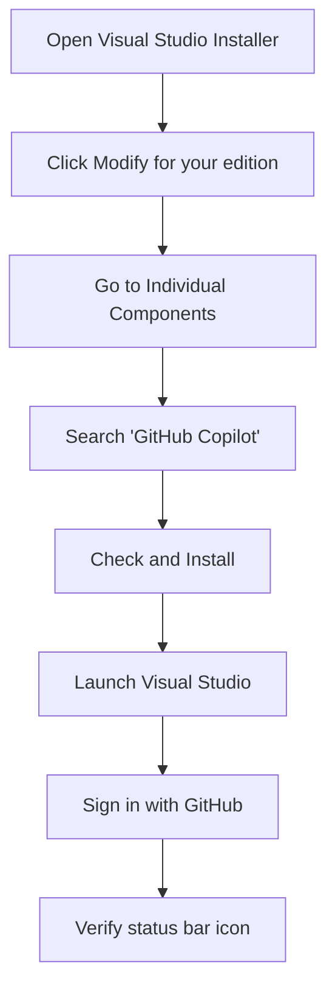

# diagram_04_installation-steps

```mermaid
flowchart TD
    Step1[Open Visual Studio Installer]
    Step2[Click Modify for your edition]
    Step3[Go to Individual Components]
    Step4[Search 'GitHub Copilot']
    Step5[Check and Install]
    Step6[Launch Visual Studio]
    Step7[Sign in with GitHub]
    Step8[Verify status bar icon]
    
    Step1 --> Step2 --> Step3 --> Step4 --> Step5 --> Step6 --> Step7 --> Step8
```
