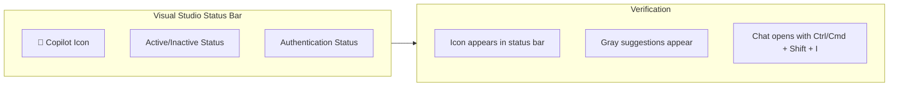

# diagram_05_8-verify--the-status-bar-icon-should-show-co-ad66

```mermaid
graph LR
    subgraph StatusBar["Visual Studio Status Bar"]
        Icon[🤖 Copilot Icon]
        Active[Active/Inactive Status]
        Auth[Authentication Status]
    end
    
    subgraph Verification["Verification"]
        Check1[Icon appears in status bar]
        Check2[Gray suggestions appear]
        Check3[Chat opens with Ctrl/Cmd + Shift + I]
    end
    
    StatusBar --> Verification
```
