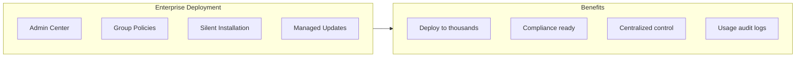

# diagram_06_for-organizations-using-visual-studio-enterprise-c9dc

```mermaid
flowchart LR
    subgraph EnterpriseDeployment["Enterprise Deployment"]
        Admin[Admin Center]
        Group[Group Policies]
        Silent[Silent Installation]
        Managed[Managed Updates]
    end
    
    subgraph Benefits["Benefits"]
        Scale[Deploy to thousands]
        Compliance[Compliance ready]
        Control[Centralized control]
        Audit[Usage audit logs]
    end
    
    EnterpriseDeployment --> Benefits
```
