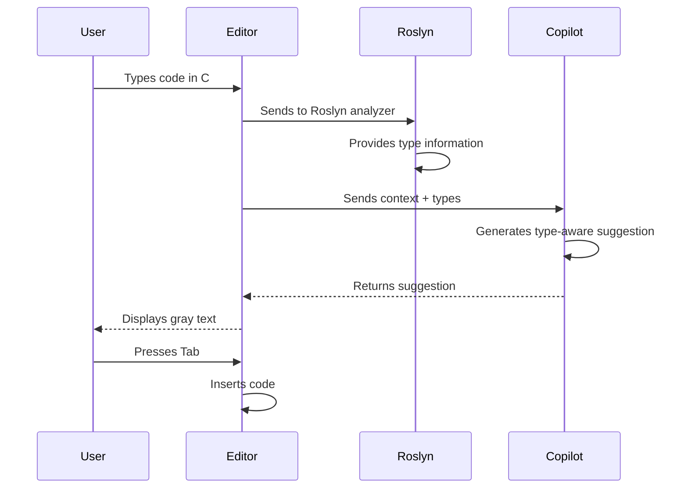

# diagram_07_how-it-works-with-net

```mermaid
sequenceDiagram
    participant User
    participant Editor
    participant Roslyn
    participant Copilot
    
    User->>Editor: Types code in C#
    Editor->>Roslyn: Sends to Roslyn analyzer
    Roslyn->>Roslyn: Provides type information
    Editor->>Copilot: Sends context + types
    Copilot->>Copilot: Generates type-aware suggestion
    Copilot-->>Editor: Returns suggestion
    Editor-->>User: Displays gray text
    User->>Editor: Presses Tab
    Editor->>Editor: Inserts code
```
