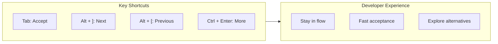

# diagram_08_open-10-suggestions-panel--ctrl--enter-twic-160a

```mermaid
flowchart LR
    subgraph Shortcuts["Key Shortcuts"]
        Tab["Tab: Accept"]
        AltRight["Alt + ]: Next"]
        AltLeft["Alt + [: Previous"]
        CtrlEnter["Ctrl + Enter: More"]
    end
    
    subgraph Experience["Developer Experience"]
        Flow["Stay in flow"]
        Fast["Fast acceptance"]
        Explore["Explore alternatives"]
    end
    
    Shortcuts --> Experience
```
