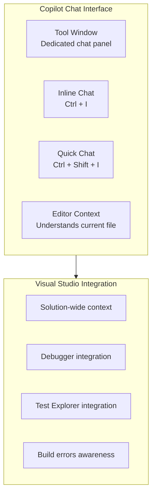

# diagram_09_chat-interface-overview

```mermaid
graph TD
    subgraph ChatInterface["Copilot Chat Interface"]
        ToolWindow[Tool Window<br/>Dedicated chat panel]
        Inline[Inline Chat<br/>Ctrl + I]
        Quick[Quick Chat<br/>Ctrl + Shift + I]
        EditorContext[Editor Context<br/>Understands current file]
    end
    
    subgraph VSIntegration["Visual Studio Integration"]
        Solution[Solution-wide context]
        Debug[Debugger integration]
        Tests[Test Explorer integration]
        Build[Build errors awareness]
    end
    
    ChatInterface --> VSIntegration
```
