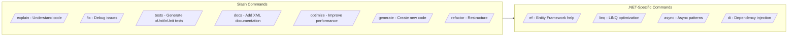

# diagram_10_slash-commands-in-chat

```mermaid
flowchart LR
    subgraph SlashCommands["Slash Commands"]
        Expl[/explain - Understand code/]
        Fix[/fix - Debug issues/]
        Test[/tests - Generate xUnit/nUnit tests/]
        Docs[/docs - Add XML documentation/]
        Opt[/optimize - Improve performance/]
        Gen[/generate - Create new code/]
        Refactor[/refactor - Restructure/]
    end
    
    subgraph .NETSpecific[".NET-Specific Commands"]
        EF[/ef - Entity Framework help/]
        LINQ[/linq - LINQ optimization/]
        Async[/async - Async patterns/]
        DI[/di - Dependency injection/]
    end
    
    SlashCommands --> .NETSpecific
```
