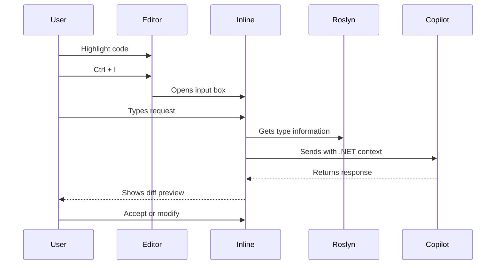

# diagram_11_inline-chat-in-visual-studio-allows-you-to-interac-0b68

```mermaid
sequenceDiagram
    participant User
    participant Editor
    participant Inline
    participant Roslyn
    
    User->>Editor: Highlight code
    User->>Editor: Ctrl + I
    Editor->>Inline: Opens input box
    User->>Inline: Types request
    Inline->>Roslyn: Gets type information
    Inline->>Copilot: Sends with .NET context
    Copilot-->>Inline: Returns response
    Inline-->>User: Shows diff preview
    User->>Inline: Accept or modify
```
