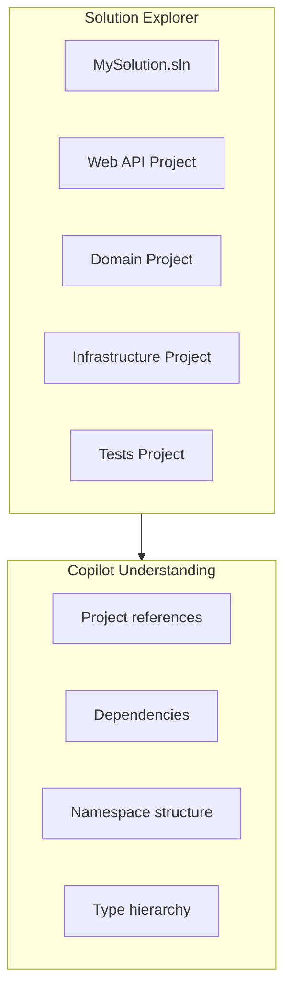

# diagram_12_solution-explorer-integration

```mermaid
graph TD
    subgraph Solution["Solution Explorer"]
        SLN[MySolution.sln]
        Proj1[Web API Project]
        Proj2[Domain Project]
        Proj3[Infrastructure Project]
        Proj4[Tests Project]
    end
    
    subgraph Copilot["Copilot Understanding"]
        Ref[Project references]
        Dep[Dependencies]
        Namespaces[Namespace structure]
        Types[Type hierarchy]
    end
    
    Solution --> Copilot
```
