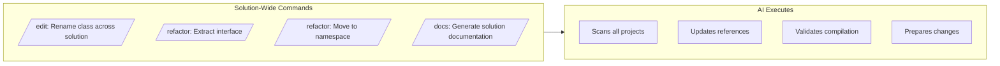

# diagram_13_solution-wide-commands

```mermaid
flowchart LR
    subgraph Commands["Solution-Wide Commands"]
        Rename[/edit: Rename class across solution/]
        Extract[/refactor: Extract interface/]
        Move[/refactor: Move to namespace/]
        Document[/docs: Generate solution documentation/]
    end
    
    subgraph Execution["AI Executes"]
        Scan[Scans all projects]
        Update[Updates references]
        Validate[Validates compilation]
        Commit[Prepares changes]
    end
    
    Commands --> Execution
```
