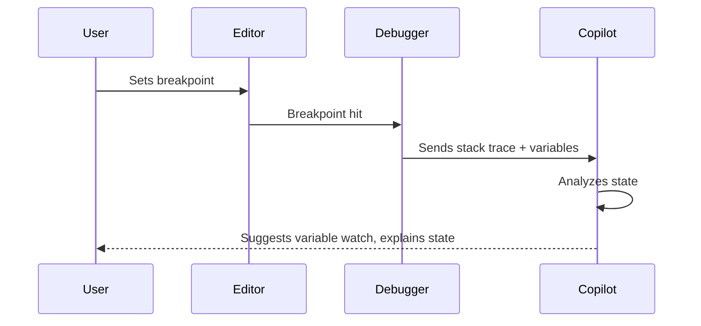

# diagram_14_ai-assisted-breakpoints

```mermaid
sequenceDiagram
    participant User
    participant Editor
    participant Debugger
    participant Copilot
    
    User->>Editor: Sets breakpoint
    Editor->>Debugger: Breakpoint hit
    Debugger->>Copilot: Sends stack trace + variables
    Copilot->>Copilot: Analyzes state
    Copilot-->>User: Suggests variable watch, explains state
```
