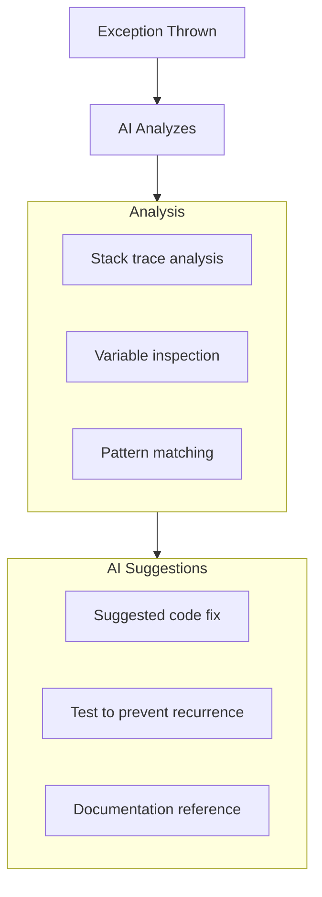

# diagram_15_exception-helpers

```mermaid
flowchart TD
    Exception[Exception Thrown]
    Copilot[AI Analyzes]
    
    subgraph Analysis["Analysis"]
        Stack[Stack trace analysis]
        Variables[Variable inspection]
        Pattern[Pattern matching]
    end
    
    subgraph Suggestions["AI Suggestions"]
        Fix[Suggested code fix]
        Tests[Test to prevent recurrence]
        Docs[Documentation reference]
    end
    
    Exception --> Copilot
    Copilot --> Analysis
    Analysis --> Suggestions
```
