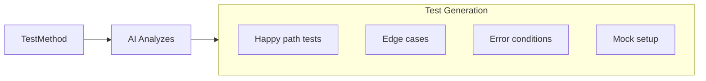

# diagram_16_test-generation

```mermaid
flowchart LR
    Method[TestMethod]
    Copilot[AI Analyzes]
    
    subgraph Generation["Test Generation"]
        Happy[Happy path tests]
        Edge[Edge cases]
        Error[Error conditions]
        Mock[Mock setup]
    end
    
    Method --> Copilot --> Generation
```
