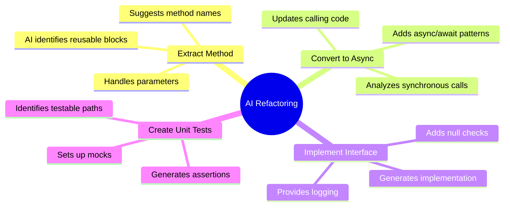

# diagram_17_intelligent-refactoring

```mermaid
mindmap
  root((AI Refactoring))
    Extract Method
      AI identifies reusable blocks
      Suggests method names
      Handles parameters
    Convert to Async
      Analyzes synchronous calls
      Adds async/await patterns
      Updates calling code
    Implement Interface
      Generates implementation
      Adds null checks
      Provides logging
    Create Unit Tests
      Identifies testable paths
      Generates assertions
      Sets up mocks
```
