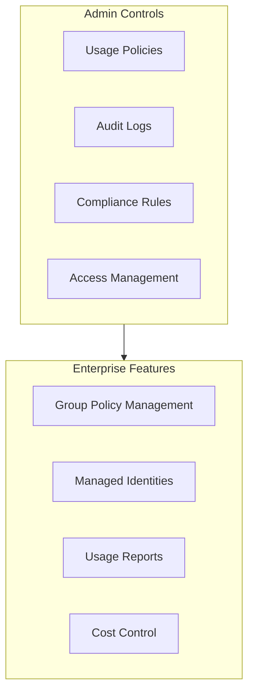

# diagram_18_admin-controls

```mermaid
graph TD
    subgraph Admin["Admin Controls"]
        Policy[Usage Policies]
        Audit[Audit Logs]
        Compliance[Compliance Rules]
        Access[Access Management]
    end
    
    subgraph Features["Enterprise Features"]
        GroupPolicies[Group Policy Management]
        ManagedIDs[Managed Identities]
        UsageReports[Usage Reports]
        CostControl[Cost Control]
    end
    
    Admin --> Features
```
