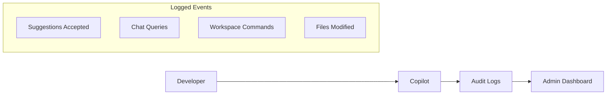

# diagram_19_audit-logging

```mermaid
flowchart LR
    User[Developer] --> Copilot
    Copilot --> Logs[Audit Logs]
    Logs --> Admin[Admin Dashboard]
    
    subgraph Logged["Logged Events"]
        Suggestions[Suggestions Accepted]
        Chat[Chat Queries]
        Commands[Workspace Commands]
        Files[Files Modified]
    end
```
