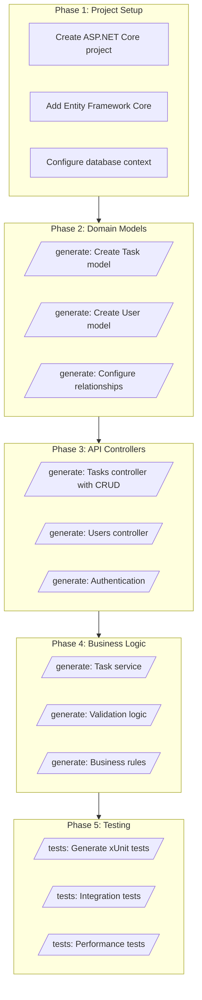

# diagram_20_scenario-create-a-task-management-api-e3d5

```mermaid
flowchart TD
    subgraph Phase1["Phase 1: Project Setup"]
        P1[Create ASP.NET Core project]
        P2[Add Entity Framework Core]
        P3[Configure database context]
    end
    
    subgraph Phase2["Phase 2: Domain Models"]
        M1[/generate: Create Task model/]
        M2[/generate: Create User model/]
        M3[/generate: Configure relationships/]
    end
    
    subgraph Phase3["Phase 3: API Controllers"]
        C1[/generate: Tasks controller with CRUD/]
        C2[/generate: Users controller/]
        C3[/generate: Authentication/]
    end
    
    subgraph Phase4["Phase 4: Business Logic"]
        B1[/generate: Task service/]
        B2[/generate: Validation logic/]
        B3[/generate: Business rules/]
    end
    
    subgraph Phase5["Phase 5: Testing"]
        T1[/tests: Generate xUnit tests/]
        T2[/tests: Integration tests/]
        T3[/tests: Performance tests/]
    end
    
    Phase1 --> Phase2 --> Phase3 --> Phase4 --> Phase5
```
