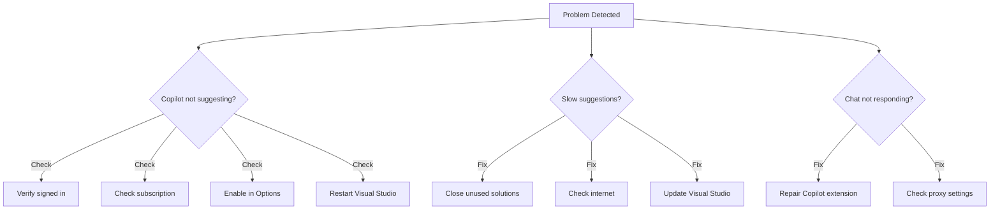

# diagram_22_common-issues-and-solutions

```mermaid
flowchart TD
    Problem[Problem Detected]
    
    Problem --> P1{Copilot not suggesting?}
    P1 -->|Check| S1[Verify signed in]
    P1 -->|Check| S2[Check subscription]
    P1 -->|Check| S3[Enable in Options]
    P1 -->|Check| S4[Restart Visual Studio]
    
    Problem --> P2{Slow suggestions?}
    P2 -->|Fix| F1[Close unused solutions]
    P2 -->|Fix| F2[Check internet]
    P2 -->|Fix| F3[Update Visual Studio]
    
    Problem --> P3{Chat not responding?}
    P3 -->|Fix| F4[Repair Copilot extension]
    P3 -->|Fix| F5[Check proxy settings]
```
