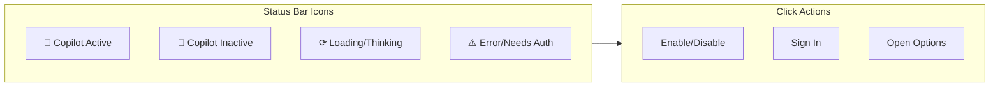

# diagram_23_status-bar-indicators

```mermaid
graph LR
    subgraph Icons["Status Bar Icons"]
        Green[🤖 Copilot Active]
        Gray[🤖 Copilot Inactive]
        Spinner[⟳ Loading/Thinking]
        Error[⚠️ Error/Needs Auth]
    end
    
    subgraph Actions["Click Actions"]
        Enable[Enable/Disable]
        SignIn[Sign In]
        Settings[Open Options]
    end
    
    Icons --> Actions
```
