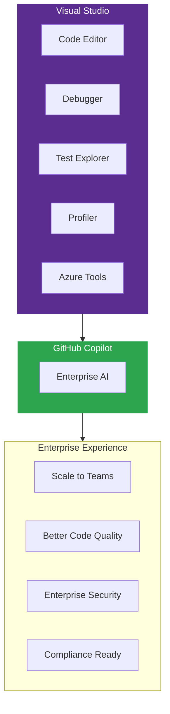

# diagram_25_copilot-in-visual-studio-meets-enterprise-develope-3ec3

```mermaid
graph TD
    subgraph VS["Visual Studio"]
        Editor[Code Editor]
        Debugger[Debugger]
        Test[Test Explorer]
        Profiler[Profiler]
        Cloud[Azure Tools]
    end
    
    subgraph Copilot["GitHub Copilot"]
        AI[Enterprise AI]
    end
    
    subgraph Experience["Enterprise Experience"]
        Scale[Scale to Teams]
        Quality[Better Code Quality]
        Security[Enterprise Security]
        Compliance[Compliance Ready]
    end
    
    VS --> Copilot
    Copilot --> Experience
    
    style VS fill:#5c2d91,stroke:#5c2d91,stroke-width:2px,color:#fff
    style Copilot fill:#2da44e,stroke:#2da44e,stroke-width:2px,color:#fff
```
