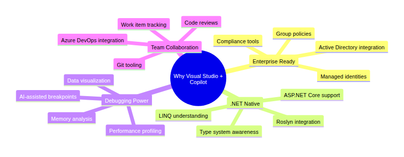
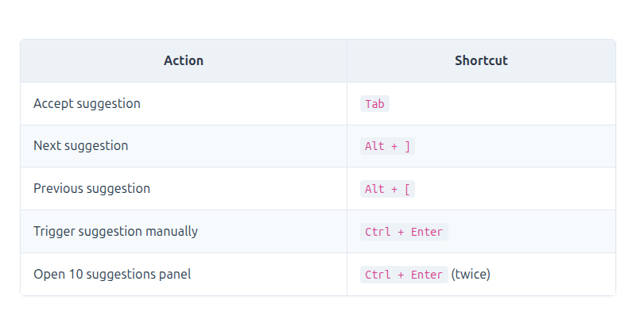
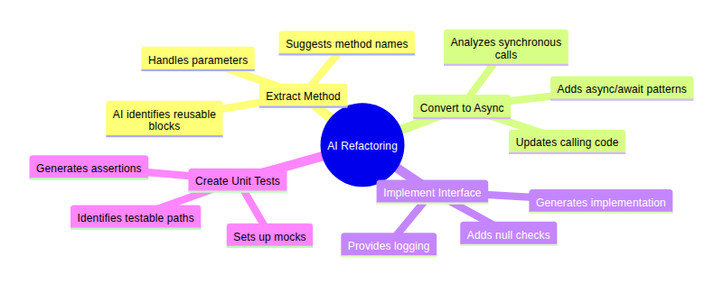
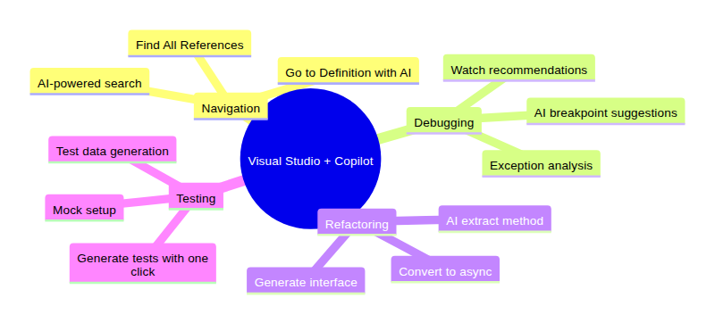
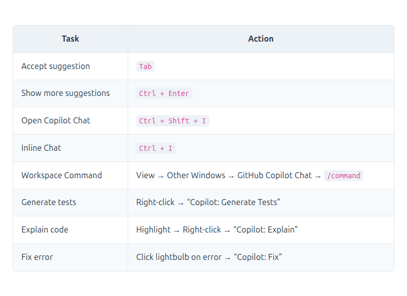
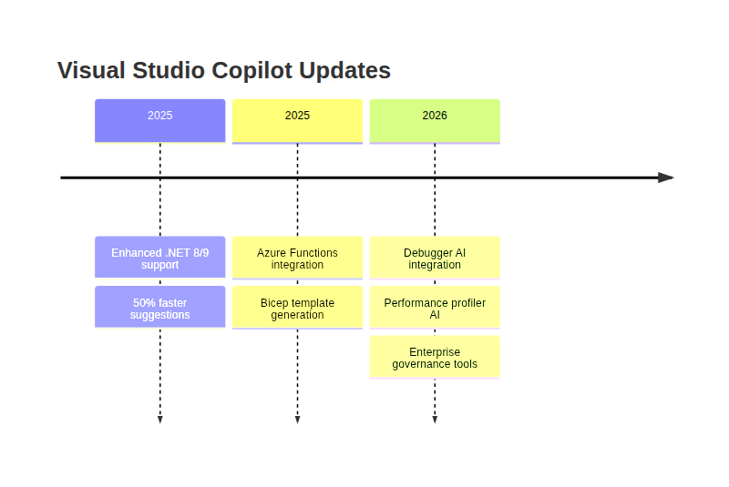

# GitHub Copilot in Visual Studio: Enterprise-Grade AI for .NET Developers
### Visual Studio Copilot, C# AI Coding, .NET Development Assistant, Azure Copilot, Enterprise AI Tools, Debugger AI
*Part of the GitHub Copilot Ecosystem Series*


## Introduction

This story is part of our comprehensive exploration of **GitHub Copilot: The AI-Powered Development Ecosystem**. While the parent story introduced the full ecosystem across all development surfaces, and the **"In the IDE"** story covered the general IDE experience, this deep dive focuses specifically on **Visual Studio**—the premier IDE for .NET, C#, and enterprise development—and how GitHub Copilot delivers enterprise-grade AI capabilities on this powerful platform.

**Companion stories in this series:** *[Links Below]*
- **📝 In the IDE** – Your AI pair programmer, always by your side
- **🌐 GitHub.com** – AI-powered collaboration at scale
- **💻 In the Terminal** – Your command line AI assistant
- **⚙️ In CI/CD** – AI-powered automation in your pipelines
- **📘 VS Code Integration** – The ultimate AI-powered development experience
- **🎯 Visual Studio Integration** – Enterprise-grade AI for .NET developers


Each story explores how GitHub Copilot transforms that specific surface, while the parent story ties them all together into a unified vision of AI-powered development.

```mermaid
```


[View Source](https://github.com/Vineet-Sharma-Medium-Stories/Medium-Assets/blob/main/github-copilot-in-visual-studio-enterprise-grade-ai-for-net-developers/diagram_01_each-story-explores-how-github-copilot-transforms-9b75.md)


---

## Visual Studio: The Enterprise Development Powerhouse

Visual Studio is the flagship IDE for professional developers building enterprise applications. With over **10 million active users**, it's the go-to platform for .NET development, C++ applications, and complex enterprise solutions. Visual Studio offers unparalleled debugging, profiling, and refactoring tools—and now, with GitHub Copilot, it adds AI-powered assistance to this powerful arsenal.

GitHub Copilot in Visual Studio isn't just a port of the VS Code experience. It's a **deeply integrated enterprise solution** that respects Visual Studio's project model, understands .NET's rich type system, and works seamlessly with your existing workflows.

```mermaid
```


[View Source](https://github.com/Vineet-Sharma-Medium-Stories/Medium-Assets/blob/main/github-copilot-in-visual-studio-enterprise-grade-ai-for-net-developers/diagram_02_github-copilot-in-visual-studio-isnt-just-a-port-4038.md)


---

## Why Visual Studio Is Perfect for Enterprise AI

Visual Studio's enterprise-focused architecture makes it the ideal platform for AI-assisted development in professional environments:

```mermaid
```



[View Source](https://github.com/Vineet-Sharma-Medium-Stories/Medium-Assets/blob/main/github-copilot-in-visual-studio-enterprise-grade-ai-for-net-developers/diagram_03_visual-studios-enterprise-focused-architecture-ma-4e11.md)


---

## 1. Getting Started: Installing GitHub Copilot in Visual Studio

### Installation Steps

```mermaid
```


[View Source](https://github.com/Vineet-Sharma-Medium-Stories/Medium-Assets/blob/main/github-copilot-in-visual-studio-enterprise-grade-ai-for-net-developers/diagram_04_installation-steps.md)


**Step-by-Step:**

1. **Open Visual Studio Installer** – Find it in your Start Menu or Applications folder
2. **Select Your Edition** – Click "Modify" on your Visual Studio installation (Enterprise, Professional, or Community)
3. **Navigate to Individual Components** – Go to the "Individual Components" tab
4. **Search for Copilot** – Type "GitHub Copilot" in the search box
5. **Select and Install** – Check the box next to "GitHub Copilot" and click "Modify"
6. **Launch Visual Studio** – Open your project or create a new one
7. **Sign In** – Click the Copilot icon in the status bar and sign in with GitHub
8. **Verify** – The status bar icon should show Copilot is active

```mermaid
```


[View Source](https://github.com/Vineet-Sharma-Medium-Stories/Medium-Assets/blob/main/github-copilot-in-visual-studio-enterprise-grade-ai-for-net-developers/diagram_05_8-verify--the-status-bar-icon-should-show-co-ad66.md)


### Enterprise Installation

For organizations using Visual Studio Enterprise, Copilot can be deployed via:

```mermaid
```


[View Source](https://github.com/Vineet-Sharma-Medium-Stories/Medium-Assets/blob/main/github-copilot-in-visual-studio-enterprise-grade-ai-for-net-developers/diagram_06_for-organizations-using-visual-studio-enterprise-c9dc.md)


**Command-line installation:**
```bash
# Silent installation for enterprise deployment
vs_enterprise.exe --add Microsoft.VisualStudio.Component.GitHubCopilot --quiet --norestart
```

---

## 2. Inline Suggestions – The Core Experience

Like VS Code, Visual Studio offers inline code suggestions that appear as you type, but with deeper integration into the .NET type system.

### How It Works with .NET

```mermaid
```


[View Source](https://github.com/Vineet-Sharma-Medium-Stories/Medium-Assets/blob/main/github-copilot-in-visual-studio-enterprise-grade-ai-for-net-developers/diagram_07_how-it-works-with-net.md)


### Example: C# with .NET Awareness

```csharp
// Type a comment describing what you want
// Create a service to fetch users from the database
// ↓ Copilot suggests:

public class UserService
{
    private readonly ApplicationDbContext _context;
    
    public UserService(ApplicationDbContext context)
    {
        _context = context;
    }
    
    public async Task<IEnumerable<User>> GetUsersAsync()
    {
        return await _context.Users.ToListAsync();
    }
    
    public async Task<User?> GetUserByIdAsync(int id)
    {
        return await _context.Users.FindAsync(id);
    }
}
```

### Keyboard Shortcuts



[View Source](https://github.com/Vineet-Sharma-Medium-Stories/Medium-Assets/blob/main/github-copilot-in-visual-studio-enterprise-grade-ai-for-net-developers/table_01_keyboard-shortcuts.md)


```mermaid
```


[View Source](https://github.com/Vineet-Sharma-Medium-Stories/Medium-Assets/blob/main/github-copilot-in-visual-studio-enterprise-grade-ai-for-net-developers/diagram_08_open-10-suggestions-panel--ctrl--enter-twic-160a.md)


---

## 3. Copilot Chat – Conversational AI in Visual Studio

Copilot Chat in Visual Studio is fully integrated with the IDE's powerful features, including solution-wide context and debugging integration.

### Chat Interface Overview

```mermaid
```


[View Source](https://github.com/Vineet-Sharma-Medium-Stories/Medium-Assets/blob/main/github-copilot-in-visual-studio-enterprise-grade-ai-for-net-developers/diagram_09_chat-interface-overview.md)


### Opening Copilot Chat

```bash
# Methods to open Copilot Chat in Visual Studio:
1. View → Other Windows → GitHub Copilot Chat
2. Press Ctrl + Shift + I for Quick Chat
3. Highlight code and press Ctrl + I for Inline Chat
4. Type / in any chat input to see commands
5. Click the Copilot icon in the status bar
```

### Chat Examples with .NET Context

**Example 1: Explaining Entity Framework Code**
```
User: [Highlight DbContext configuration] /explain: What does this do?

Copilot: This configures Entity Framework Core with SQL Server:
- OnConfiguring: Sets up the database connection string
- OnModelCreating: Configures entity relationships and constraints
- Uses lazy loading proxies for navigation properties
- Enables sensitive data logging for development only

This pattern is typical for ASP.NET Core applications using EF Core.
```

**Example 2: Generating ASP.NET Core Controller**
```
User: /generate: Create a REST API controller for managing products with CRUD operations

Copilot: [Generates complete controller with dependency injection]
[ApiController]
[Route("api/[controller]")]
public class ProductsController : ControllerBase
{
    private readonly ApplicationDbContext _context;
    private readonly ILogger<ProductsController> _logger;
    
    public ProductsController(ApplicationDbContext context, ILogger<ProductsController> logger)
    {
        _context = context;
        _logger = logger;
    }
    
    [HttpGet]
    public async Task<ActionResult<IEnumerable<Product>>> GetProducts()
    {
        return await _context.Products.ToListAsync();
    }
    
    [HttpGet("{id}")]
    public async Task<ActionResult<Product>> GetProduct(int id)
    {
        var product = await _context.Products.FindAsync(id);
        if (product == null)
        {
            return NotFound();
        }
        return product;
    }
    
    [HttpPost]
    public async Task<ActionResult<Product>> PostProduct(Product product)
    {
        _context.Products.Add(product);
        await _context.SaveChangesAsync();
        return CreatedAtAction(nameof(GetProduct), new { id = product.Id }, product);
    }
    
    [HttpPut("{id}")]
    public async Task<IActionResult> PutProduct(int id, Product product)
    {
        if (id != product.Id)
        {
            return BadRequest();
        }
        
        _context.Entry(product).State = EntityState.Modified;
        
        try
        {
            await _context.SaveChangesAsync();
        }
        catch (DbUpdateConcurrencyException)
        {
            if (!ProductExists(id))
            {
                return NotFound();
            }
            throw;
        }
        
        return NoContent();
    }
    
    [HttpDelete("{id}")]
    public async Task<IActionResult> DeleteProduct(int id)
    {
        var product = await _context.Products.FindAsync(id);
        if (product == null)
        {
            return NotFound();
        }
        
        _context.Products.Remove(product);
        await _context.SaveChangesAsync();
        
        return NoContent();
    }
    
    private bool ProductExists(int id)
    {
        return _context.Products.Any(e => e.Id == id);
    }
}
```

**Example 3: Fixing LINQ Errors**
```
User: This LINQ query is throwing "NullReferenceException"

Copilot: The error occurs because you're accessing properties on a null object.
Add null checks or use the null-conditional operator:

// Original
var names = users.Select(u => u.Address.City).ToList();

// Fix with null propagation
var names = users.Select(u => u.Address?.City).Where(c => c != null).ToList();

// Or with Where clause
var names = users.Where(u => u.Address != null)
                 .Select(u => u.Address.City)
                 .ToList();
```

### Slash Commands in Chat

```mermaid
```


[View Source](https://github.com/Vineet-Sharma-Medium-Stories/Medium-Assets/blob/main/github-copilot-in-visual-studio-enterprise-grade-ai-for-net-developers/diagram_10_slash-commands-in-chat.md)


---

## 4. Inline Chat – Coding Without Context Switching

Inline Chat in Visual Studio allows you to interact with Copilot without leaving your current cursor position, with full understanding of your .NET code.

```mermaid
```


[View Source](https://github.com/Vineet-Sharma-Medium-Stories/Medium-Assets/blob/main/github-copilot-in-visual-studio-enterprise-grade-ai-for-net-developers/diagram_11_inline-chat-in-visual-studio-allows-you-to-interac-0b68.md)


### Inline Chat Examples

**Refactoring to Async:**
```
User: [Highlight synchronous method] Convert to async with proper error handling

Copilot: [Shows diff with async/await version]
public async Task<User> GetUserAsync(int id)
{
    try
    {
        return await _context.Users.FindAsync(id);
    }
    catch (Exception ex)
    {
        _logger.LogError(ex, "Error getting user {UserId}", id);
        throw;
    }
}
```

**Adding XML Documentation:**
```
User: [Highlight service method] Add XML documentation with examples

Copilot: [Adds comprehensive XML comments]
/// <summary>
/// Retrieves a user by their unique identifier.
/// </summary>
/// <param name="id">The user's unique identifier.</param>
/// <returns>
/// The user object if found; otherwise, null.
/// </returns>
/// <exception cref="ArgumentException">
/// Thrown when id is less than or equal to zero.
/// </exception>
/// <example>
/// <code>
/// var user = await userService.GetUserAsync(42);
/// if (user != null)
/// {
///     Console.WriteLine($"Found: {user.Name}");
/// }
/// </code>
/// </example>
```

---

## 5. Solution-Wide Context and Commands

Visual Studio's Copilot understands your entire solution, including projects, references, and dependencies.

### Solution Explorer Integration

```mermaid
```


[View Source](https://github.com/Vineet-Sharma-Medium-Stories/Medium-Assets/blob/main/github-copilot-in-visual-studio-enterprise-grade-ai-for-net-developers/diagram_12_solution-explorer-integration.md)


### Solution-Wide Commands

```mermaid
```


[View Source](https://github.com/Vineet-Sharma-Medium-Stories/Medium-Assets/blob/main/github-copilot-in-visual-studio-enterprise-grade-ai-for-net-developers/diagram_13_solution-wide-commands.md)


**Example: Rename Across Solution**
```
/edit: Rename 'UserService' to 'AccountService' across the entire solution

Copilot analysis:
- Found 47 references across 12 files
- Affects: Web API, Domain, Infrastructure, Tests
- Also updates: DI registrations, interface implementations, unit tests

Apply changes? [Preview] [Apply] [Cancel]
```

---

## 6. Debugger Integration – AI-Powered Debugging

One of Visual Studio's superpowers is its debugger. Copilot integrates deeply with the debugger to provide AI-powered insights.

### AI-Assisted Breakpoints

```mermaid
```


[View Source](https://github.com/Vineet-Sharma-Medium-Stories/Medium-Assets/blob/main/github-copilot-in-visual-studio-enterprise-grade-ai-for-net-developers/diagram_14_ai-assisted-breakpoints.md)


**Example: Debugger Integration**
```
[Breakpoint hit in PaymentService.ProcessPayment]

Copilot suggests:
🔍 Analysis:
- payment object is null at line 42
- Check the calling method - PaymentRepository may be returning null
- Consider adding null check before processing

Suggested watch expressions:
- paymentRepository.GetPayment(id)
- _context.Payments.Find(id)

Would you like to add these watches? [Yes] [No]
```

### Exception Helpers

```mermaid
```


[View Source](https://github.com/Vineet-Sharma-Medium-Stories/Medium-Assets/blob/main/github-copilot-in-visual-studio-enterprise-grade-ai-for-net-developers/diagram_15_exception-helpers.md)


**Example: NullReferenceException**
```
NullReferenceException: Object reference not set to an instance of an object

Copilot analysis:
🔍 The exception occurred at line 47 in `OrderService.CalculateTotal`:
   `return order.Items.Sum(i => i.Price * i.Quantity);`

Root Cause:
- `order` is not null, but `order.Items` is null
- The Items collection wasn't initialized when the order was created

Suggested Fix:
public class Order
{
    public Order()
    {
        Items = new List<OrderItem>();
    }
    
    public List<OrderItem> Items { get; set; }
}

Would you like to apply this fix? [Apply] [Show More]
```

---

## 7. Test Explorer Integration – AI-Powered Testing

Copilot integrates with Visual Studio's Test Explorer to generate and manage tests.

### Test Generation

```mermaid
```


[View Source](https://github.com/Vineet-Sharma-Medium-Stories/Medium-Assets/blob/main/github-copilot-in-visual-studio-enterprise-grade-ai-for-net-developers/diagram_16_test-generation.md)


**Example: Generate xUnit Tests**
```
User: [Highlight CalculateTotal method] /tests: Generate xUnit tests with Moq

Copilot generates:
public class OrderServiceTests
{
    private readonly Mock<IOrderRepository> _orderRepositoryMock;
    private readonly OrderService _orderService;
    
    public OrderServiceTests()
    {
        _orderRepositoryMock = new Mock<IOrderRepository>();
        _orderService = new OrderService(_orderRepositoryMock.Object);
    }
    
    [Fact]
    public async Task CalculateTotal_WithValidOrder_ReturnsCorrectTotal()
    {
        // Arrange
        var order = new Order
        {
            Id = 1,
            Items = new List<OrderItem>
            {
                new OrderItem { Price = 10.00m, Quantity = 2 },
                new OrderItem { Price = 15.00m, Quantity = 1 }
            }
        };
        
        _orderRepositoryMock.Setup(x => x.GetOrderAsync(1))
            .ReturnsAsync(order);
        
        // Act
        var result = await _orderService.CalculateTotal(1);
        
        // Assert
        Assert.Equal(35.00m, result);
    }
    
    [Fact]
    public async Task CalculateTotal_WithEmptyOrder_ReturnsZero()
    {
        // Arrange
        var order = new Order
        {
            Id = 1,
            Items = new List<OrderItem>()
        };
        
        _orderRepositoryMock.Setup(x => x.GetOrderAsync(1))
            .ReturnsAsync(order);
        
        // Act
        var result = await _orderService.CalculateTotal(1);
        
        // Assert
        Assert.Equal(0.00m, result);
    }
    
    [Fact]
    public async Task CalculateTotal_WithNullOrder_ThrowsException()
    {
        // Arrange
        _orderRepositoryMock.Setup(x => x.GetOrderAsync(1))
            .ReturnsAsync((Order)null);
        
        // Act & Assert
        await Assert.ThrowsAsync<OrderNotFoundException>(
            () => _orderService.CalculateTotal(1)
        );
    }
}
```

---

## 8. Refactoring and Code Generation

Visual Studio's powerful refactoring tools are enhanced by Copilot's AI capabilities.

### Intelligent Refactoring

```mermaid
```



[View Source](https://github.com/Vineet-Sharma-Medium-Stories/Medium-Assets/blob/main/github-copilot-in-visual-studio-enterprise-grade-ai-for-net-developers/diagram_17_intelligent-refactoring.md)


**Example: Extract Method with AI**
```csharp
// Before: Complex method with multiple responsibilities
public async Task<OrderResult> ProcessOrder(OrderRequest request)
{
    // Validate order
    if (request.Items == null || !request.Items.Any())
        throw new ArgumentException("Order has no items");
    
    foreach (var item in request.Items)
    {
        if (item.Quantity <= 0)
            throw new ArgumentException($"Invalid quantity for {item.ProductId}");
    }
    
    // Calculate total
    decimal total = 0;
    foreach (var item in request.Items)
    {
        total += item.Price * item.Quantity;
    }
    
    // Apply discounts
    if (request.CouponCode != null)
    {
        var discount = await _discountService.GetDiscountAsync(request.CouponCode);
        if (discount != null)
        {
            total = total * (1 - discount.Percentage);
        }
    }
    
    // Process payment
    var payment = await _paymentService.ProcessPayment(request.PaymentMethod, total);
    
    // Create order
    var order = new Order
    {
        Id = Guid.NewGuid(),
        UserId = request.UserId,
        Items = request.Items,
        Total = total,
        PaymentId = payment.Id,
        Status = OrderStatus.Completed
    };
    
    return new OrderResult
    {
        OrderId = order.Id,
        Total = total,
        Status = order.Status
    };
}

// Copilot suggests extracting these methods:
// - ValidateOrder()
// - CalculateTotal()
// - ApplyDiscount()
// - ProcessPayment()
// - CreateOrder()
```

---

## 9. Azure Integration – Cloud Development with AI

Visual Studio's deep Azure integration is enhanced by Copilot's cloud-aware suggestions.

### Azure Functions Development

```csharp
// Copilot generates Azure Functions with proper bindings
[FunctionName("ProcessOrder")]
public static async Task<IActionResult> Run(
    [HttpTrigger(AuthorizationLevel.Function, "post")] HttpRequest req,
    [Blob("orders/{rand-guid}.json", FileAccess.Write)] Stream outputBlob,
    [Queue("order-queue")] IAsyncCollector<OrderMessage> queue,
    ILogger log)
{
    // Copilot generates the implementation
    string requestBody = await new StreamReader(req.Body).ReadToEndAsync();
    var order = JsonConvert.DeserializeObject<Order>(requestBody);
    
    // Store in blob
    await outputBlob.WriteAsync(Encoding.UTF8.GetBytes(requestBody));
    
    // Queue for processing
    await queue.AddAsync(new OrderMessage
    {
        OrderId = order.Id,
        Timestamp = DateTime.UtcNow
    });
    
    log.LogInformation($"Order {order.Id} received");
    
    return new OkObjectResult(new { orderId = order.Id });
}
```

### ARM/Bicep Template Generation

```
User: /generate: Create Bicep template for App Service with SQL Database

Copilot generates:
param appName string
param location string = resourceGroup().location
param sku string = 'B1'

resource appService 'Microsoft.Web/sites@2022-03-01' = {
  name: appName
  location: location
  properties: {
    serverFarmId: appServicePlan.id
    siteConfig: {
      alwaysOn: true
      netFrameworkVersion: 'v6.0'
    }
  }
}

resource appServicePlan 'Microsoft.Web/serverfarms@2022-03-01' = {
  name: '${appName}-plan'
  location: location
  sku: {
    name: sku
  }
}

resource sqlServer 'Microsoft.Sql/servers@2021-11-01' = {
  name: '${appName}-sql'
  location: location
  properties: {
    administratorLogin: 'sqladmin'
    administratorLoginPassword: '@app-setting("sqlPassword")'
  }
}

resource sqlDatabase 'Microsoft.Sql/servers/databases@2021-11-01' = {
  parent: sqlServer
  name: '${appName}-db'
  location: location
  sku: {
    name: 'S0'
  }
}
```

---

## 10. Enterprise Features and Governance

Visual Studio Enterprise includes advanced governance features for Copilot.

### Admin Controls

```mermaid
```


[View Source](https://github.com/Vineet-Sharma-Medium-Stories/Medium-Assets/blob/main/github-copilot-in-visual-studio-enterprise-grade-ai-for-net-developers/diagram_18_admin-controls.md)


### Group Policy Configuration

```xml
<!-- Group Policy for Copilot in Visual Studio -->
<GroupPolicy>
    <Copilot>
        <Enabled>true</Enabled>
        <AllowedUsers>Domain\Developers</AllowedUsers>
        <BlockedUsers>Domain\Interns</BlockedUsers>
        <SuggestionThreshold>Standard</SuggestionThreshold>
        <Logging>Detailed</Logging>
        <ComplianceMode>SOC2</ComplianceMode>
    </Copilot>
</GroupPolicy>
```

### Audit Logging

```mermaid
```


[View Source](https://github.com/Vineet-Sharma-Medium-Stories/Medium-Assets/blob/main/github-copilot-in-visual-studio-enterprise-grade-ai-for-net-developers/diagram_19_audit-logging.md)


---

## 11. Hands-On Tutorial: Building a .NET Web API with Copilot

Let's walk through building a complete .NET Web API using all of Copilot's Visual Studio capabilities.

### Scenario: Create a Task Management API

```mermaid
```


[View Source](https://github.com/Vineet-Sharma-Medium-Stories/Medium-Assets/blob/main/github-copilot-in-visual-studio-enterprise-grade-ai-for-net-developers/diagram_20_scenario-create-a-task-management-api-e3d5.md)


### Step 1: Create Project with Copilot

```
User: /generate: Create ASP.NET Core Web API with Entity Framework Core, JWT authentication, and Swagger

Copilot generates project with:
- Program.cs with service registrations
- appsettings.json with configuration
- JWT authentication setup
- Swagger configuration
- Entity Framework Core with SQL Server
- Repository pattern
- Unit of work pattern
```

### Step 2: Generate Domain Models

```csharp
// In chat, with Models folder open:
/generate: Create Task entity with properties: Id, Title, Description, Status, Priority, DueDate, CreatedAt, UserId

// Copilot generates:
public class Task
{
    public int Id { get; set; }
    public string Title { get; set; } = string.Empty;
    public string? Description { get; set; }
    public TaskStatus Status { get; set; } = TaskStatus.Pending;
    public TaskPriority Priority { get; set; } = TaskPriority.Medium;
    public DateTime? DueDate { get; set; }
    public DateTime CreatedAt { get; set; } = DateTime.UtcNow;
    public int UserId { get; set; }
    
    // Navigation property
    public virtual User User { get; set; } = null!;
}

public enum TaskStatus
{
    Pending,
    InProgress,
    Completed,
    Cancelled
}

public enum TaskPriority
{
    Low,
    Medium,
    High,
    Critical
}
```

### Step 3: Generate API Controller

```csharp
// In chat, with Controllers folder open:
/generate: Create TasksController with CRUD operations, authorization, and DTOs

// Copilot generates complete controller:
[Authorize]
[ApiController]
[Route("api/[controller]")]
public class TasksController : ControllerBase
{
    private readonly IApplicationDbContext _context;
    private readonly ILogger<TasksController> _logger;
    private readonly ITaskService _taskService;
    
    public TasksController(
        IApplicationDbContext context,
        ILogger<TasksController> logger,
        ITaskService taskService)
    {
        _context = context;
        _logger = logger;
        _taskService = taskService;
    }
    
    [HttpGet]
    public async Task<ActionResult<IEnumerable<TaskDto>>> GetTasks(
        [FromQuery] TaskStatus? status,
        [FromQuery] TaskPriority? priority)
    {
        var userId = User.GetUserId();
        var tasks = await _taskService.GetUserTasksAsync(userId, status, priority);
        return Ok(tasks.Select(t => t.ToDto()));
    }
    
    [HttpGet("{id}")]
    public async Task<ActionResult<TaskDto>> GetTask(int id)
    {
        var userId = User.GetUserId();
        var task = await _taskService.GetTaskByIdAsync(id, userId);
        
        if (task == null)
            return NotFound();
            
        return Ok(task.ToDto());
    }
    
    [HttpPost]
    public async Task<ActionResult<TaskDto>> CreateTask(CreateTaskDto createDto)
    {
        var userId = User.GetUserId();
        var task = await _taskService.CreateTaskAsync(createDto, userId);
        
        return CreatedAtAction(nameof(GetTask), new { id = task.Id }, task.ToDto());
    }
    
    [HttpPut("{id}")]
    public async Task<IActionResult> UpdateTask(int id, UpdateTaskDto updateDto)
    {
        var userId = User.GetUserId();
        var result = await _taskService.UpdateTaskAsync(id, updateDto, userId);
        
        if (!result)
            return NotFound();
            
        return NoContent();
    }
    
    [HttpDelete("{id}")]
    public async Task<IActionResult> DeleteTask(int id)
    {
        var userId = User.GetUserId();
        var result = await _taskService.DeleteTaskAsync(id, userId);
        
        if (!result)
            return NotFound();
            
        return NoContent();
    }
}
```

### Step 4: Generate DTOs

```csharp
// Copilot generates DTOs for request/response
public class TaskDto
{
    public int Id { get; set; }
    public string Title { get; set; } = string.Empty;
    public string? Description { get; set; }
    public string Status { get; set; } = string.Empty;
    public string Priority { get; set; } = string.Empty;
    public DateTime? DueDate { get; set; }
    public DateTime CreatedAt { get; set; }
}

public class CreateTaskDto
{
    [Required]
    [StringLength(200)]
    public string Title { get; set; } = string.Empty;
    
    [StringLength(1000)]
    public string? Description { get; set; }
    
    public TaskPriority Priority { get; set; } = TaskPriority.Medium;
    public DateTime? DueDate { get; set; }
}

public class UpdateTaskDto
{
    public string? Title { get; set; }
    public string? Description { get; set; }
    public TaskStatus? Status { get; set; }
    public TaskPriority? Priority { get; set; }
    public DateTime? DueDate { get; set; }
}
```

### Step 5: Generate Unit Tests

```csharp
// In chat, with TasksController open:
/tests: Generate xUnit tests for TasksController with Moq

// Copilot generates comprehensive tests:
public class TasksControllerTests
{
    private readonly Mock<IApplicationDbContext> _contextMock;
    private readonly Mock<ILogger<TasksController>> _loggerMock;
    private readonly Mock<ITaskService> _taskServiceMock;
    private readonly TasksController _controller;
    
    public TasksControllerTests()
    {
        _contextMock = new Mock<IApplicationDbContext>();
        _loggerMock = new Mock<ILogger<TasksController>>();
        _taskServiceMock = new Mock<ITaskService>();
        _controller = new TasksController(
            _contextMock.Object,
            _loggerMock.Object,
            _taskServiceMock.Object);
        
        // Setup user context
        var user = new ClaimsPrincipal(new ClaimsIdentity(new[]
        {
            new Claim(ClaimTypes.NameIdentifier, "1")
        }));
        _controller.ControllerContext = new ControllerContext
        {
            HttpContext = new DefaultHttpContext { User = user }
        };
    }
    
    [Fact]
    public async Task GetTasks_ReturnsTasks_WhenUserHasTasks()
    {
        // Arrange
        var tasks = new List<Task>
        {
            new Task { Id = 1, Title = "Task 1", UserId = 1 },
            new Task { Id = 2, Title = "Task 2", UserId = 1 }
        };
        
        _taskServiceMock.Setup(x => x.GetUserTasksAsync(1, null, null))
            .ReturnsAsync(tasks);
        
        // Act
        var result = await _controller.GetTasks(null, null);
        
        // Assert
        var okResult = Assert.IsType<OkObjectResult>(result.Result);
        var returnTasks = Assert.IsType<List<TaskDto>>(okResult.Value);
        Assert.Equal(2, returnTasks.Count);
    }
    
    [Fact]
    public async Task GetTask_ReturnsNotFound_WhenTaskDoesNotExist()
    {
        // Arrange
        _taskServiceMock.Setup(x => x.GetTaskByIdAsync(999, 1))
            .ReturnsAsync((Task)null);
        
        // Act
        var result = await _controller.GetTask(999);
        
        // Assert
        Assert.IsType<NotFoundResult>(result.Result);
    }
    
    [Fact]
    public async Task CreateTask_ReturnsCreated_WhenValid()
    {
        // Arrange
        var createDto = new CreateTaskDto
        {
            Title = "New Task",
            Priority = TaskPriority.High
        };
        
        var createdTask = new Task
        {
            Id = 1,
            Title = "New Task",
            Priority = TaskPriority.High,
            UserId = 1
        };
        
        _taskServiceMock.Setup(x => x.CreateTaskAsync(createDto, 1))
            .ReturnsAsync(createdTask);
        
        // Act
        var result = await _controller.CreateTask(createDto);
        
        // Assert
        var createdAtResult = Assert.IsType<CreatedAtActionResult>(result.Result);
        var taskDto = Assert.IsType<TaskDto>(createdAtResult.Value);
        Assert.Equal(1, taskDto.Id);
    }
}
```

### Step 6: Generate Documentation

```csharp
// In chat:
/docs: Add XML documentation for the TasksController

// Copilot adds comprehensive documentation:
/// <summary>
/// Manages tasks for authenticated users.
/// </summary>
/// <remarks>
/// This controller provides CRUD operations for tasks.
/// All endpoints require authentication via JWT bearer token.
/// </remarks>
[Authorize]
[ApiController]
[Route("api/[controller]")]
[Produces("application/json")]
[Consumes("application/json")]
public class TasksController : ControllerBase
{
    /// <summary>
    /// Retrieves all tasks for the current user.
    /// </summary>
    /// <param name="status">Optional filter by task status</param>
    /// <param name="priority">Optional filter by task priority</param>
    /// <returns>A list of tasks matching the filters</returns>
    /// <response code="200">Returns the list of tasks</response>
    /// <response code="401">If the user is not authenticated</response>
    [HttpGet]
    [ProducesResponseType(typeof(IEnumerable<TaskDto>), StatusCodes.Status200OK)]
    [ProducesResponseType(StatusCodes.Status401Unauthorized)]
    public async Task<ActionResult<IEnumerable<TaskDto>>> GetTasks(
        [FromQuery] TaskStatus? status,
        [FromQuery] TaskPriority? priority)
    {
        // Implementation...
    }
}
```

---

## 12. Visual Studio Copilot Tips and Tricks

### Productivity Boosters

```mermaid
```



[View Source](https://github.com/Vineet-Sharma-Medium-Stories/Medium-Assets/blob/main/github-copilot-in-visual-studio-enterprise-grade-ai-for-net-developers/diagram_21_productivity-boosters.md)


### Quick Reference Card



[View Source](https://github.com/Vineet-Sharma-Medium-Stories/Medium-Assets/blob/main/github-copilot-in-visual-studio-enterprise-grade-ai-for-net-developers/table_02_quick-reference-card.md)


### .NET-Specific Tips

```csharp
// 1. Use XML comments to guide Copilot
/// <summary>
/// Calculates the total price including tax and discounts
/// </summary>
public decimal CalculateTotal(Order order) { ... }

// 2. Leverage type information for better suggestions
public async Task<User?> GetUserAsync(int id) => 
    await _context.Users.FindAsync(id);

// 3. Use interfaces to guide implementation
public interface IUserService
{
    Task<User> CreateUserAsync(CreateUserDto dto);
    Task<User?> GetUserByIdAsync(int id);
}
// Copilot will implement these methods
```

---

## 13. Troubleshooting Visual Studio Copilot

### Common Issues and Solutions

```mermaid
```


[View Source](https://github.com/Vineet-Sharma-Medium-Stories/Medium-Assets/blob/main/github-copilot-in-visual-studio-enterprise-grade-ai-for-net-developers/diagram_22_common-issues-and-solutions.md)


### Status Bar Indicators

```mermaid
```


[View Source](https://github.com/Vineet-Sharma-Medium-Stories/Medium-Assets/blob/main/github-copilot-in-visual-studio-enterprise-grade-ai-for-net-developers/diagram_23_status-bar-indicators.md)


---

## What's New in Visual Studio Copilot (2025-2026)

```mermaid
```



[View Source](https://github.com/Vineet-Sharma-Medium-Stories/Medium-Assets/blob/main/github-copilot-in-visual-studio-enterprise-grade-ai-for-net-developers/diagram_24_whats-new-in-visual-studio-copilot-2025-2026-639e.md)


### Latest Features

- **.NET 9 Support** – Full awareness of latest .NET features
- **Azure Integration** – Functions, App Services, Container Apps
- **Debugger AI** – Breakpoint suggestions, exception analysis
- **Performance Profiler AI** – Optimization recommendations
- **Enterprise Controls** – Group policies, audit logs, compliance
- **Blazor Support** – Full Blazor component generation

### Coming Soon

- **AI-Powered Code Reviews** – Automatic PR review within Visual Studio
- **Intelligent Refactoring** – AI-suggested architecture improvements
- **Legacy Code Modernization** – Convert .NET Framework to .NET 8/9
- **Database-First Development** – Generate EF Core models from databases
- **Microservices Scaffolding** – Generate microservice architecture

---

## Conclusion

GitHub Copilot in Visual Studio represents the ultimate enterprise AI development experience. With deep .NET integration, powerful debugging tools, and enterprise-grade governance, it transforms Visual Studio from a powerful IDE into an AI-augmented development environment.

Whether you're:
- **Building .NET Applications** – Inline suggestions understand C#, LINQ, EF Core
- **Developing Azure Solutions** – Generate Functions, ARM templates, Bicep
- **Debugging Complex Issues** – AI helps identify root causes and fixes
- **Writing Tests** – Generate xUnit/nUnit tests automatically
- **Refactoring Code** – AI-powered restructuring across solutions
- **Managing Enterprise Teams** – Governance, policies, and audit logs

Copilot in Visual Studio meets enterprise developers where they build mission-critical applications, making teams faster, code more reliable, and developers more productive.

```mermaid
```


[View Source](https://github.com/Vineet-Sharma-Medium-Stories/Medium-Assets/blob/main/github-copilot-in-visual-studio-enterprise-grade-ai-for-net-developers/diagram_25_copilot-in-visual-studio-meets-enterprise-develope-3ec3.md)


## Complete Story Links

- [📖 **GitHub Copilot** – The AI-Powered Development Ecosystem](#)   
- 📝 **In the IDE** – Your AI pair programmer, always by your side - Comming soon 
- 🌐 **GitHub.com** – AI-powered collaboration at scale -  - Comming soon 
- 💻 **In the Terminal** – Your command line AI assistant - - Comming soon  
- ⚙️ **In CI/CD** – AI-powered automation in your pipelines - - Comming soon  
- 📘 **VS Code Integration** – The ultimate AI-powered development experience - Comming soon  
- 🎯 **Visual Studio Integration** – Enterprise-grade AI for .NET developers - - Comming soon  

---

**Get Started with GitHub Copilot in Visual Studio**

```bash
# Install GitHub Copilot
1. Open Visual Studio Installer
2. Select Visual Studio → Modify
3. Go to Individual Components
4. Search "GitHub Copilot"
5. Select and Install
6. Launch Visual Studio
7. Sign in with GitHub

# Verify installation
- Look for Copilot icon in status bar (🤖)
- Start typing a comment and see suggestions
- Open Copilot Chat with Ctrl + Shift + I
```

Start your enterprise AI-powered development journey at [github.com/features/copilot](https://github.com/features/copilot)

---

*This story is part of the GitHub Copilot Ecosystem Series. Last updated March 2026.*

_Questions? Feedback? Comment? leave a response below. If you're implementing something similar and want to discuss architectural tradeoffs, I'm always happy to connect with fellow engineers tackling these challenges._