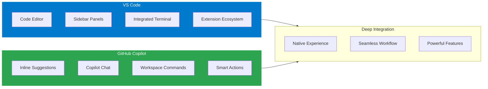

# diagram_02_the-integration-between-github-copilot-and-vs-code-453e

```mermaid
flowchart LR
    subgraph VSCode["VS Code"]
        Editor[Code Editor]
        Sidebar[Sidebar Panels]
        Terminal[Integrated Terminal]
        Extensions[Extension Ecosystem]
    end
    
    subgraph Copilot["GitHub Copilot"]
        Inline[Inline Suggestions]
        Chat[Copilot Chat]
        Commands[Workspace Commands]
        Actions[Smart Actions]
    end
    
    subgraph Integration["Deep Integration"]
        Native[Native Experience]
        Seamless[Seamless Workflow]
        Powerful[Powerful Features]
    end
    
    VSCode --> Integration
    Copilot --> Integration
    
    style VSCode fill:#007acc,stroke:#007acc,stroke-width:2px,color:#fff
    style Copilot fill:#2da44e,stroke:#2da44e,stroke-width:2px,color:#fff
```
