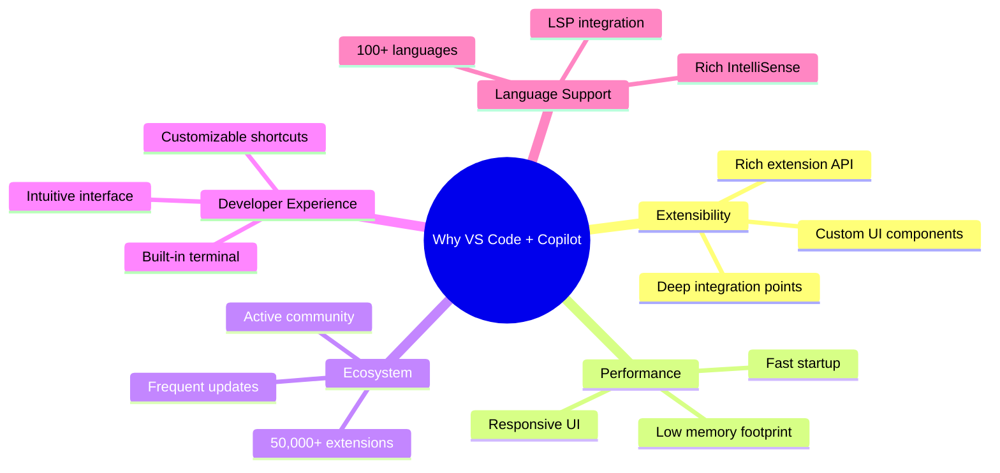

# diagram_03_vs-codes-architecture-makes-it-the-ideal-platform-d5d4

```mermaid
mindmap
  root((Why VS Code + Copilot))
    Extensibility
      Rich extension API
      Deep integration points
      Custom UI components
    Performance
      Fast startup
      Low memory footprint
      Responsive UI
    Ecosystem
      50,000+ extensions
      Active community
      Frequent updates
    Developer Experience
      Intuitive interface
      Customizable shortcuts
      Built-in terminal
    Language Support
      100+ languages
      LSP integration
      Rich IntelliSense
```
