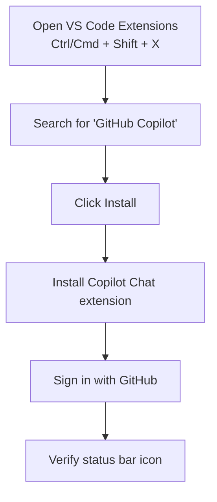

# diagram_04_installation-steps

```mermaid
flowchart TD
    Step1[Open VS Code Extensions<br/>Ctrl/Cmd + Shift + X]
    Step2[Search for 'GitHub Copilot']
    Step3[Click Install]
    Step4[Install Copilot Chat extension]
    Step5[Sign in with GitHub]
    Step6[Verify status bar icon]
    
    Step1 --> Step2 --> Step3 --> Step4 --> Step5 --> Step6
```
