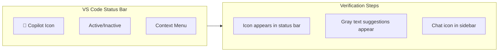

# diagram_05_6-verify--check-the-status-bar-for-the-copil-7e6f

```mermaid
graph LR
    subgraph StatusBar["VS Code Status Bar"]
        Icon[🤖 Copilot Icon]
        Indicator[Active/Inactive]
        Menu[Context Menu]
    end
    
    subgraph Verification["Verification Steps"]
        Check1[Icon appears in status bar]
        Check2[Gray text suggestions appear]
        Check3[Chat icon in sidebar]
    end
    
    StatusBar --> Verification
```
