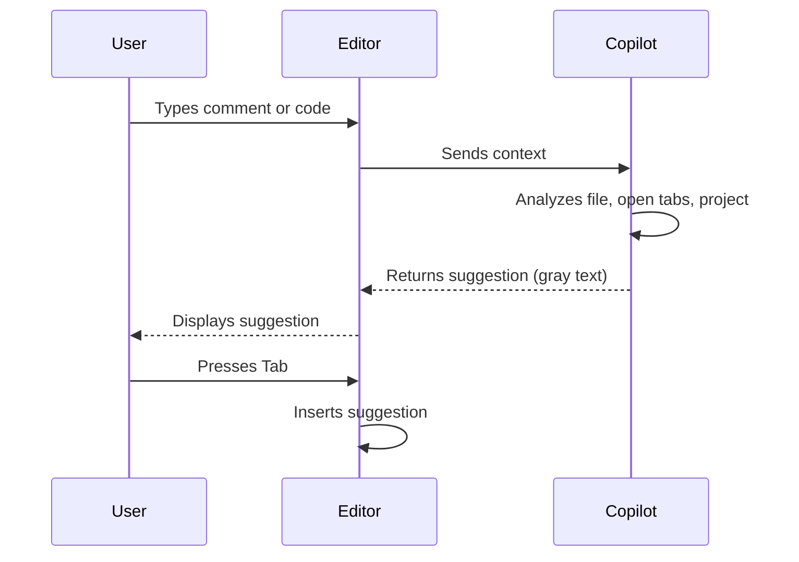

# diagram_06_how-it-works

```mermaid
sequenceDiagram
    participant User
    participant Editor
    participant Copilot
    
    User->>Editor: Types comment or code
    Editor->>Copilot: Sends context
    Copilot->>Copilot: Analyzes file, open tabs, project
    Copilot-->>Editor: Returns suggestion (gray text)
    Editor-->>User: Displays suggestion
    User->>Editor: Presses Tab
    Editor->>Editor: Inserts suggestion
```
