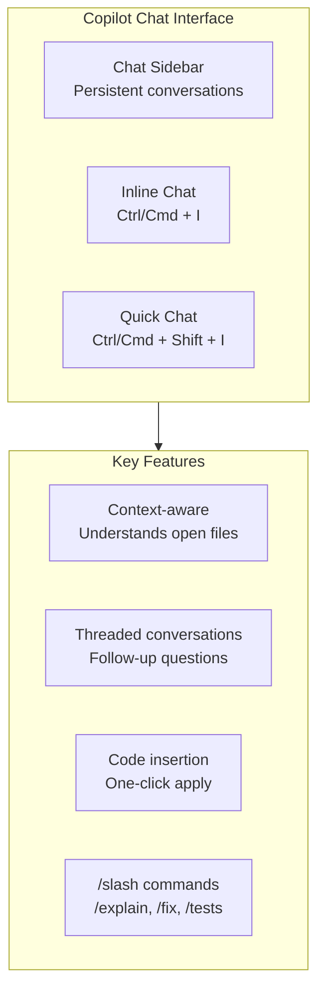

# diagram_08_chat-interface-overview

```mermaid
graph TD
    subgraph ChatInterface["Copilot Chat Interface"]
        Sidebar["Chat Sidebar<br/>Persistent conversations"]
        Inline["Inline Chat<br/>Ctrl/Cmd + I"]
        Quick["Quick Chat<br/>Ctrl/Cmd + Shift + I"]
    end
    
    subgraph Features["Key Features"]
        Context["Context-aware<br/>Understands open files"]
        Thread["Threaded conversations<br/>Follow-up questions"]
        Code["Code insertion<br/>One-click apply"]
        Slash["/slash commands<br/>/explain, /fix, /tests"]
    end
    
    ChatInterface --> Features
```
