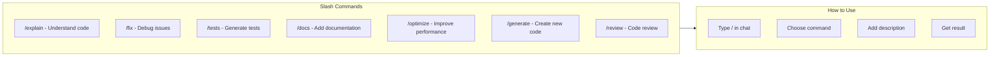

# diagram_09_slash-commands-in-chat

```mermaid
flowchart LR
    subgraph SlashCommands["Slash Commands"]
        Expl["/explain - Understand code"]
        Fix["/fix - Debug issues"]
        Test["/tests - Generate tests"]
        Docs["/docs - Add documentation"]
        Opt["/optimize - Improve performance"]
        Gen["/generate - Create new code"]
        Review["/review - Code review"]
    end
    
    subgraph Usage["How to Use"]
        Type["Type / in chat"]
        Select["Choose command"]
        Describe["Add description"]
        Execute["Get result"]
    end
    
    SlashCommands --> Usage
```
