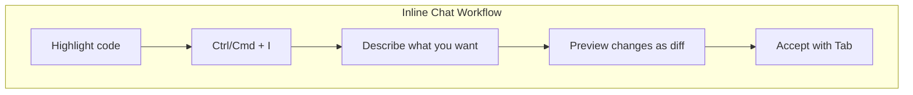

# diagram_11_untitled

```mermaid
flowchart TD
    subgraph InlineWorkflow["Inline Chat Workflow"]
        Highlight[Highlight code]
        Trigger[Ctrl/Cmd + I]
        Type[Describe what you want]
        Preview[Preview changes as diff]
        Accept[Accept with Tab]
    end
    
    Highlight --> Trigger --> Type --> Preview --> Accept
```
