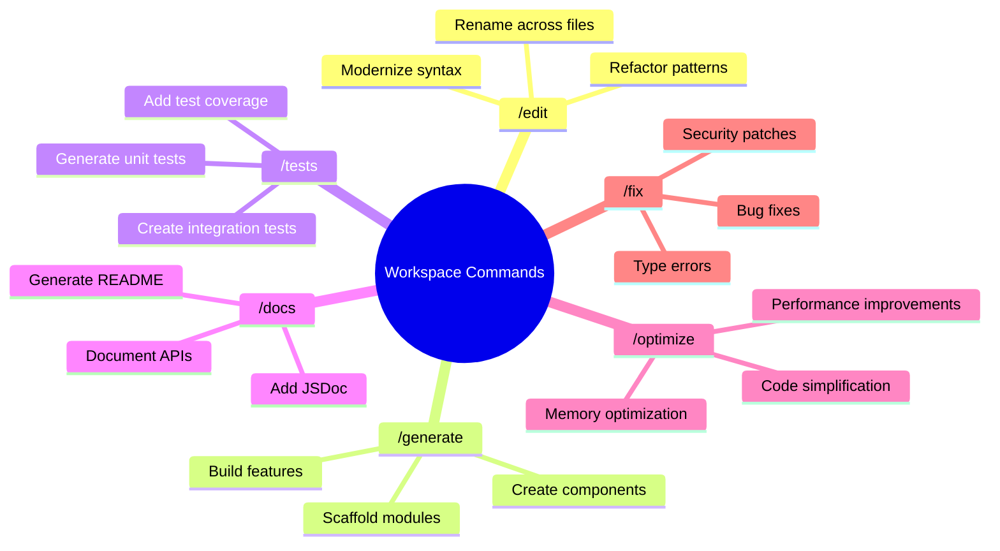

# diagram_12_available-commands

```mermaid
mindmap
  root((Workspace Commands))
    /edit
      Rename across files
      Refactor patterns
      Modernize syntax
    /generate
      Create components
      Scaffold modules
      Build features
    /tests
      Generate unit tests
      Create integration tests
      Add test coverage
    /docs
      Document APIs
      Generate README
      Add JSDoc
    /optimize
      Performance improvements
      Code simplification
      Memory optimization
    /fix
      Bug fixes
      Security patches
      Type errors
```
