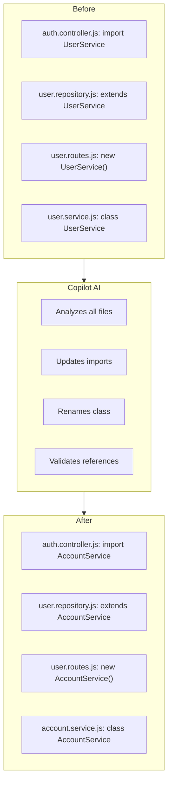

# diagram_13_result

```mermaid
flowchart TD
    subgraph Before["Before"]
        File1["auth.controller.js: import UserService"]
        File2["user.repository.js: extends UserService"]
        File3["user.routes.js: new UserService()"]
        File4["user.service.js: class UserService"]
    end
    
    subgraph AI["Copilot AI"]
        Analysis["Analyzes all files"]
        Updates["Updates imports"]
        Renames["Renames class"]
        Validates["Validates references"]
    end
    
    subgraph After["After"]
        File1A["auth.controller.js: import AccountService"]
        File2A["user.repository.js: extends AccountService"]
        File3A["user.routes.js: new AccountService()"]
        File4A["account.service.js: class AccountService"]
    end
    
    Before --> AI --> After
```
