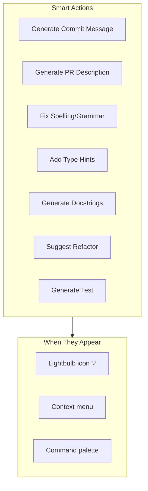

# diagram_14_available-smart-actions

```mermaid
graph TD
    subgraph Actions["Smart Actions"]
        Commit[Generate Commit Message]
        PR[Generate PR Description]
        Fix[Fix Spelling/Grammar]
        Types[Add Type Hints]
        Docs[Generate Docstrings]
        Refactor[Suggest Refactor]
        Test[Generate Test]
    end
    
    subgraph Triggers["When They Appear"]
        Lightbulb[Lightbulb icon 💡]
        Context[Context menu]
        Command[Command palette]
    end
    
    Actions --> Triggers
```
