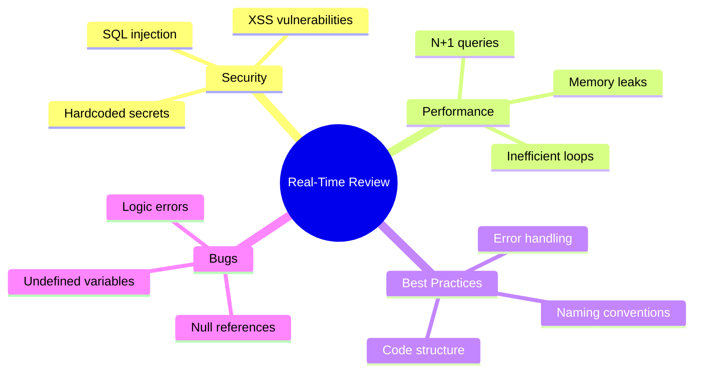

# diagram_17_review-features

```mermaid
mindmap
  root((Real-Time Review))
    Security
      SQL injection
      XSS vulnerabilities
      Hardcoded secrets
    Performance
      N+1 queries
      Inefficient loops
      Memory leaks
    Best Practices
      Naming conventions
      Error handling
      Code structure
    Bugs
      Null references
      Undefined variables
      Logic errors
```
