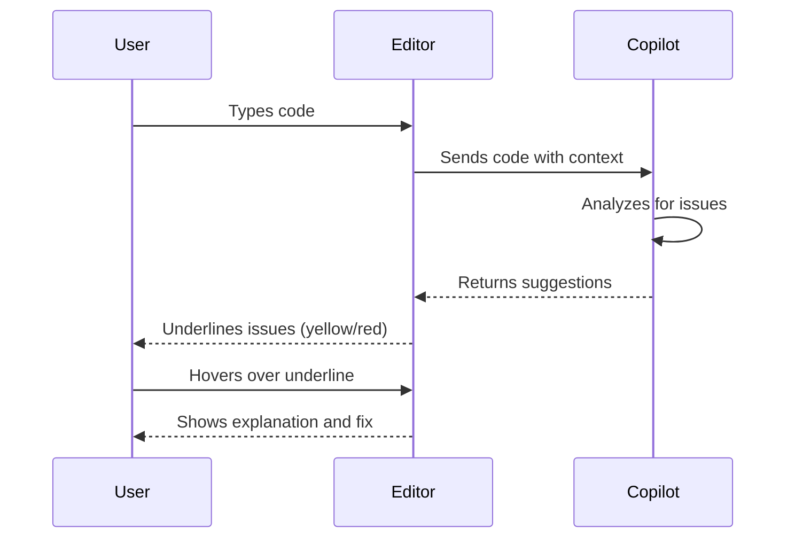

# diagram_18_how-it-works

```mermaid
sequenceDiagram
    participant User
    participant Editor
    participant Copilot
    
    User->>Editor: Types code
    Editor->>Copilot: Sends code with context
    Copilot->>Copilot: Analyzes for issues
    Copilot-->>Editor: Returns suggestions
    Editor-->>User: Underlines issues (yellow/red)
    User->>Editor: Hovers over underline
    Editor-->>User: Shows explanation and fix
```
